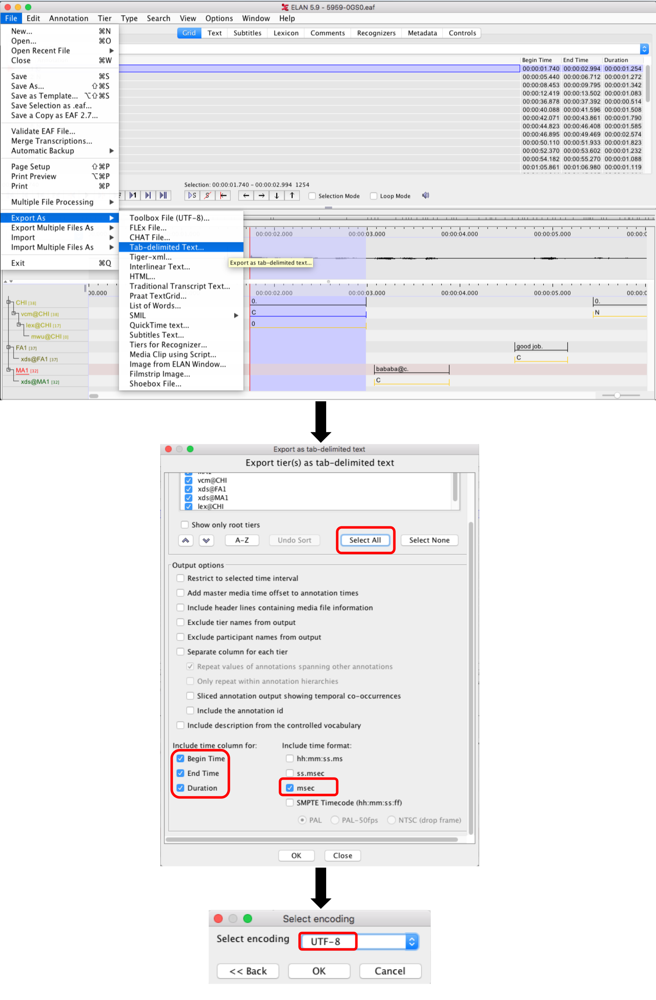

# Background

A big part of the research technician's job will be to write scripts that facilitate data collection, annotation, and analysis. This technical task is meant to give you an idea of the type of work involved in prepping data for analysis.

When RAs manually annotate data in the lab, they may use one of several applications, depending on the type of data (e.g., Excel/Google Spreadsheets, Praat, ELAN, Datavyu, etc.). When it comes to doing analysis, however, we need to get their annotations into a text-based tabular format. Usually this can be done by hand within each application (e.g., via some specialized export function) but it's often much quicker and less error-prone to do this re-formatting automatically.

I have provided you here with an .eaf file. This file type is used in the application [ELAN](https://archive.mpi.nl/tla/elan) and, underlyingly, it is just XML. I am also providing you with an example of a tab-delimited text file. The text file features a few of the key fields that we typically use for analysis with transcribed data. I created the text file by exporting it manually in the ELAN environment and selecting a subset of the output options, as shown here.



## Task summary

Your task is to create a tool that takes, as input, an .eaf file (structured as in the example) and gives, as output, a .txt file (structured as in the example). The output file should appear next to the input file in the same directory by default, and with the same basename as the input file.

### Level 1: Command-line script, input path as argument

Provide me with a program and associated code for running this tool at the command line. Your tool should:

* Take an input path as an argument,
* Provide usage info for the argument (and any flags you create), and
* Be able to run over single files or batches of files, e.g., at input `PATH/*.eaf`

Note: Use R or Python, as you like.

_Why this level?_ More advanced students and researchers who want to reuse our lab's open-source code are likely to be comfortable running scripts at the command line, often finding this more convenient than having to hand-edit a script in order to adjust it to their requirements.

### Level 2: 
Modify the code to produce output listed chronologically by chronological ordering and  annotations for subtiers below their respective 
main annotations.

* Modify your code to output the list by chronological ordering. The ordering should be based on the start and end times, in that order.
* In addition, your code should output subtier lines (lines that start with lower case `vcm@`, `xds@` or `lex@`) below the main tier lines. For example: 

```
CHI	CHI	1740	2994	1254	0.
vcm@CHI	CHI	1740	2994	1254	C
lex@CHI	CHI	1740	2994	1254	0

```


### Level 3:

Modify your code to output a couple of summary data: 

* Which speaker had the most turns?
* Which speaker talked the most (cumulatively)? 
* Which speaker had the most **non-speaking** turns (where instead of any annotations, there is only `0.`)?


## Submission

Please share with us a private GitHub repo with your code. We will be looking at your code style, commenting, edge case 
handling, README clarity, etc. Your task should run successfully and be tidily documented in line with your current best ability.

While working on the assignment, feel free to look things up—Google, Stack Overflow, ChatGPT, whatever helps.
Just make sure to drop a short comment in your code noting any external sources you draw on.
We won’t deduct points for using these aids.
